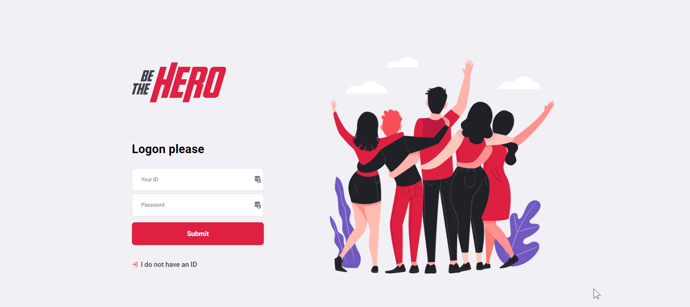

# The Hero App  - Javascript

### This is a sample app made during the 'Omnistack week' from Rockseat. It is a fictional startup to connect donnors (heros) to NOGs causes: Hurt animals, etc.

## Getting Started
The project is separeted by folders:
1. Back-End ([set up](/backend/))
    * SQLite
    * NodeJs, Express
    * Tests
        - Integration
        - Unit
2. Front-End ([set up](/frontend/))
    * ReactJS

3. Mobile ([set up](/mobile/))
    * ReactNative

This is a project made for learning purpose:
- Added JWT auth (very simple)

Next:
- Add notification to the Frontend
