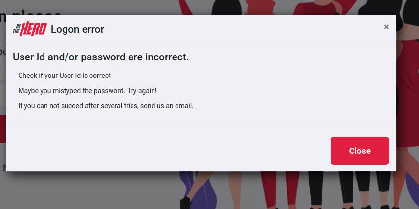

# The Hero App  - Javascript
## Live demo: [https://heroappjs.marques.top](https://heroappjs.marques.top)

### This is a sample app made during the 'Omnistack week' from Rockseat. It is a fictional startup to connect donnors (heros) to NOGs causes: Hurt animals, etc.

The objective is to keep learning. If there is a better way tell me please, but if it is just ugly don't look. 😉

## Getting Started
The project is separeted by folders:
1. Back-End ([set up](/backend/))
    * ~~SQLite~~ Updated to Postgres 12.2
    * NodeJs, Express, knex
    * Tests
        - Integration
        - Unit
2. Front-End ([set up](/frontend/))
    * ReactJS

3. Mobile ([set up](/mobile/))
    * ReactNative

This is a project made for learning purpose:
- Added JWT auth
- Added validation to express routes
- added custom dialog instead of `browser's default`:

- PostgreSQL instead of SQLite
- Docker
- Deploy `https://heroappjs.marques.top` SSL

Next:
- Add notification to the Frontend
